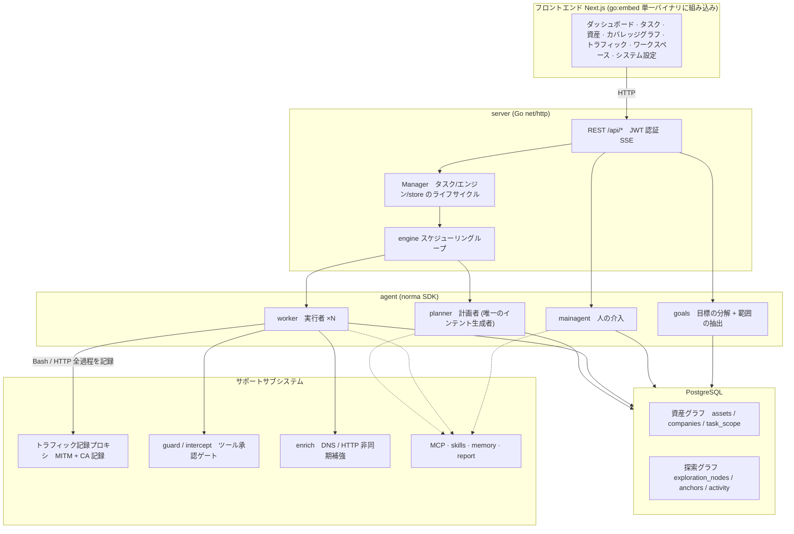
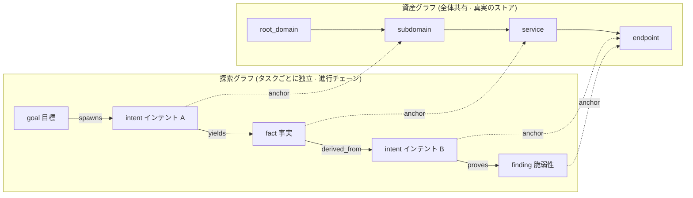
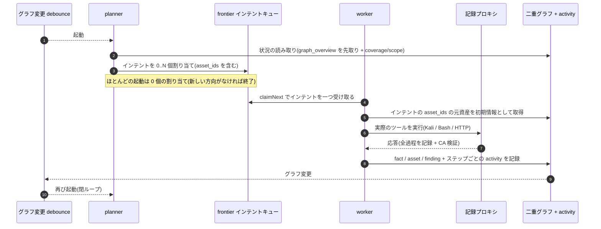
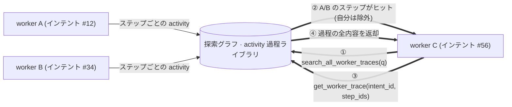
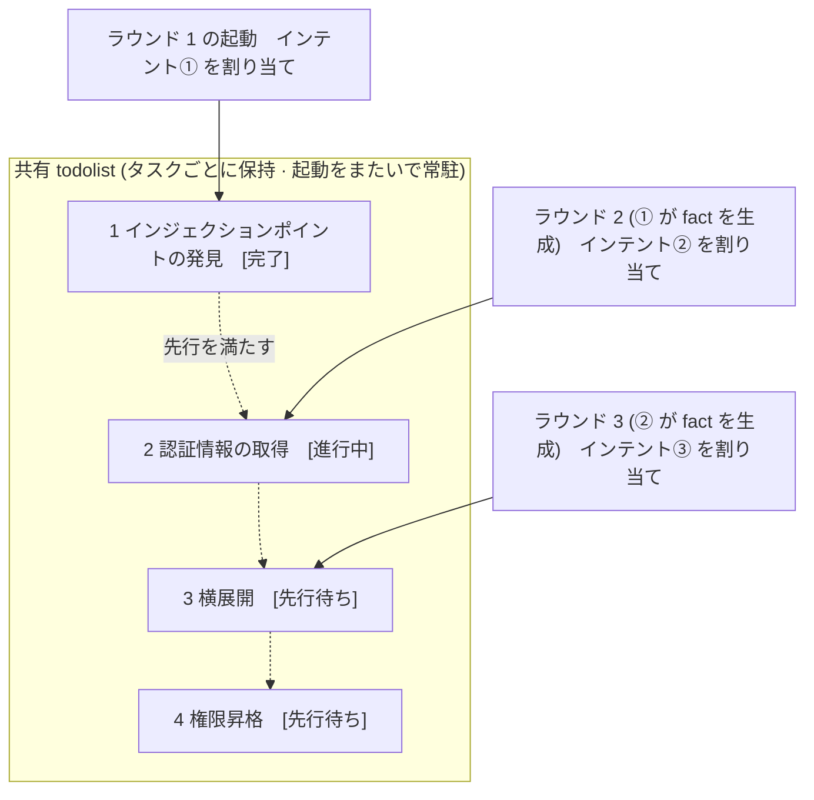

<div align="center">

# ARTEX 韓国語版

**LLM マルチエージェントが自律的にペネトレーションテストを実行するシステム** (Go バックエンド + Next.js フロントエンド)

韓国語 · [中文](README.zh.md) · [English](README.en.md)

[](https://github.com/jiwoochris/artex-ko/actions/workflows/ci.yml) [](https://github.com/jiwoochris/artex-ko/actions/workflows/detections.yml) [](https://github.com/jiwoochris/artex-ko/actions/workflows/web.yml) [](LICENSE)

</div>

---

> ## 🚨 セキュリティ・悪用に関する警告: 必ず最初にお読みください
>
> **このリポジトリは、権限を付与された環境で、防御と検知の能力を高める目的にのみ使うことを前提に公開しています。**
>
> ARTEX は、人がほとんど介入しなくても、偵察から侵入、データの持ち出しまで攻撃の過程を自ら実行できるほど強力な自律型攻撃ツールです。それだけに、悪用による被害も大きくなります。2026年10月、韓国の複数のメディアは、オリジナルの ARTEX が韓国の金融機関を狙った個人情報流出攻撃に使われた形跡を捜査当局が捉えたと報じており、関連する捜査が進行中です。この韓国語版を公開する目的は、攻撃を手助けすることではありません。防御する側がこうした自律型 AI 攻撃の動作原理を理解し、検知してブロックする能力を備えられるよう支援することが目的です。
>
> - **許可のない使用は、それ自体が犯罪になります。** 自分が所有している、または書面で明示的な許可を得た対象でない限り、いかなるシステムに対してもスキャン・探索・エクスプロイトを実行しないでください。大韓民国では、権限なく情報通信網に侵入する行為は情報通信網法違反であり、個人情報が絡む場合は個人情報保護法も併せて適用されます。
> - **実サービスや他人の資産を対象にしないでください。** 学習と研究、そして自分が所有するローカルの隔離環境 (OWASP Juice Shop・DVWA のように意図的に脆弱に作られた環境) でのみ検証してください。
> - **防御する視点で読んでください。** このリポジトリは、自律型 AI 攻撃の検知シグネチャやハードニングチェックリストなど、防御・検知の資料も併せて整備していきます。 → **[自律型 AI 攻撃の防御・検知ガイド](docs/defense-ko.md)**
>
> この警告と、以下の[利用制限・免責](#ライセンスと免責)に同意しない場合は、このリポジトリをダウンロードしたり使用したりしないでください。

---

> **このリポジトリは、中国発のオープンソースプロジェクト [Autumn-27/ARTEX](https://github.com/Autumn-27/ARTEX) (AGPL-3.0) を、韓国のユーザーやチームがそのまま使えるようにローカライズしたバージョンです。** エージェントの判断性能を保つため、内部の推論プロンプトは原文のままにし、ユーザーに見える成果物 (検知結果・要約・レポート・対話の応答) だけを韓国語に強制します。方針は下の「なぜ韓国語版なのか」で説明します。

ARTEX は、LLM が操る複数のエージェントが**自ら目標を分割し、実際のツールを実行し、発見した資産と脆弱性をグラフに積み上げながら**、ペネトレーションテストの過程を自律的に進めるシステムです。Go の単一バイナリに Next.js フロントエンドが組み込まれており、データは PostgreSQL に保存されます。

---

<!--
  この見出しのエムダッシュ (—) は意図的に残しています。リポジトリのスタイルでは韓国語の文章中の
  エムダッシュをコロンに置き換えますが、この見出しだけは例外です。GitHub のアンカースラッグ
  (エムダッシュの両側の空白が二重ハイフン "--" になります)を
  次の五か所が参照しているためです: CODE_OF_CONDUCT.md · CONTRIBUTING.md · SECURITY.md ·
  .github/PULL_REQUEST_TEMPLATE.md · .github/ISSUE_TEMPLATE/config.yml.
  エムダッシュをコロンに置き換えると、スラッグの二重ハイフンが単一ハイフンになり、五つのリンクがすべて切れます。
  見出しを変えるときは、五つの参照のアンカーも一緒に直し、`python3 -I scripts/check-doc-links.py` が
  EXIT 0 を維持していることを確認してください。
-->
## ⚠️ 最初にお読みください — 利用範囲と国内法に関する告知

ARTEX は、**自分が所有している、または書面で明示的な許可を得た対象に対してのみ**使用できます。許可された範囲を超えるスキャン・探索・エクスプロイトは、それ自体が違法になり得ます。

- 大韓民国では、権限なく他人の情報通信網に侵入したり障害を起こしたりする行為は、**「情報通信網利用促進及び情報保護等に関する法律」** 違反です。
- ペネトレーションテストの過程で収集・露出する個人情報には、**「個人情報保護法」** が適用されます。権限があっても、個人情報の閲覧・保管・破棄は慎重に扱う必要があります。
- **学習・研究・ローカル隔離環境での検証**の目的で使ってください。運用中の外部システムを対象にする前には、必ず書面による許可と、範囲・時間帯の合意を確保する必要があります。

ライセンス・利用制限・免責の詳細は、下の[ライセンスと免責](#ライセンスと免責)の節にあります。このツールを使用するだけで、ユーザーはそれらの条件に同意したものとみなされます。

---

## なぜ韓国語版なのか

オリジナルの ARTEX は、プロンプト・UI・ドキュメントがすべて中国語で書かれており、韓国のユーザーが結果を読んでチームと共有するのが面倒でした。この韓国語版は次のことを目標にしています。

- **成果物の韓国語化**: エージェントが人に向けて出力する検知結果・事実の要約・最終レポート・対話の応答を、韓国語で出力するよう強制します。コマンド・ペイロード・コード・URL・ログの原文は分析に必要なため、そのまま残します。
- **性能の維持**: エージェントの判断を左右する内部の推論プロンプト (行動指針の本文) は翻訳しません。原文でベンチマークされた動作を維持し、出力言語だけを変えることで、翻訳に起因する品質低下を避けます。
- **国内法の告知**: 情報通信網法・個人情報保護法の告知と「権限範囲内でのみ使用」という警告を、韓国語ではっきりと提示します。
- **国内スタックへの対応**: LLM プロバイダーを、フロンティアモデルだけでなく OpenAI 互換エンドポイント (国産・オープンモデル) にも切り替えられます。下の[設定](#設定)を参照してください。

> ローカライズの境界と設計方針は、リポジトリの作業ドキュメントにより詳しく書かれています。上流 (upstream) リポジトリの変更と照合しやすいように、オリジナルの中国語ドキュメントは `README.zh.md` として保存しています。

---

## 画面プレビュー

下の三つの画面は、韓国語化を終えた実際の UI です。ローカルの隔離サンドボックスで取得したデモデータで、対象はすべて架空の `acme.com` とプライベート帯域です。

<p align="center">
  <br>
  <sub><b>ダッシュボード</b>: アクティブなタスク・確認済みの脆弱性・資産ノード・LLM トークン消費とアクティビティの流れを一画面で確認できます。</sub><br>
  <sub>このダッシュボード画面は、ラベルをローカライズする前に取得したデモキャプチャのため、'LLM Token 消費' カードのデータ元の名前がまだコード識別子 <code>llm_usage</code> のまま表示されています。現在のビルドでは、同じ位置を新バージョンでは「計量台帳」、旧バージョンでは「アクティビティ統計」と表示します。</sub>
</p>

<p align="center">
  <br>
  <sub><b>脆弱性</b>: 深刻度・状態・資産・所属タスクで検知結果を集計し、CSV でエクスポートします。</sub><br>
  <sub>脆弱性の<b>タイトル</b>はモデルが生成した値のため、対象アプリや技術用語に合わせて英語が混じることがあります ([モデル選択と出力言語](#モデル選択と出力言語)を参照)。タイトルの下の説明と画面全体は韓国語で表示されます。</sub>
</p>

<p align="center">
  <br>
  <sub><b>対話</b>: 自律実行中に人が割り込んでヒントを与え、エージェントが攻撃チェーンを韓国語で要約します。</sub>
</p>

オリジナル (中国語 UI) の全画面は [`README.zh.md`](README.zh.md#截图预览) で確認できます。

---

## クイックスタート (Docker Compose)

> **前提条件:** Docker と Docker Compose。データベースは **PostgreSQL** で、compose が一緒に起動します。探索には **LLM** が必要です (`ANTHROPIC_API_KEY` または `OPENAI_API_KEY`、UI からも設定できます)。

> **⚠️ 現在この compose が取得するイメージは、上流 (オリジナル) の中国語ビルドです。** `docker-compose.yml` の `artex` サービスは、原作者が Docker Hub に公開している `autumn27/artex` イメージを取得します。このイメージは**中国語の UI と中国語の出力**のため、このリポジトリが追加した韓国語化 (韓国語 UI・韓国語レポート・`langDirective`) は**まだ含まれていません**。韓国語版の画面と出力を確認するには、現時点では下の["その他のインストール方法"](#その他のインストール方法)にある**ソースから単一バイナリをコンパイル**する手順で、自分でビルドしてください。韓国語版 Docker イメージの配布は準備中です。

```bash
git clone https://github.com/jiwoochris/artex-ko.git
cd artex-ko
cp .env.example .env          # POSTGRES_PASSWORD を設定、ANTHROPIC_API_KEY は任意
docker compose up -d          # artex イメージ + postgres を一緒に起動
# → http://localhost:8787 にアクセス (初回は /setup で管理者パスワードを設定)
```

上記の上流イメージには、よく使うツール (ripgrep・curl・vim・npm・nmap など) が含まれています。`./skills` と `./data` はバインドマウントでホスト側に残るため、コンテナを作り直しても保持されます。

### その他のインストール方法

オリジナルのリポジトリは、インストールスクリプト (`./install.sh`)、事前コンパイル済みバイナリ (Releases)、ソースからの単一バイナリコンパイルなど、複数の方法を提供しています。コマンドと手順は [`README.zh.md`](README.zh.md#安装) の「安装」(インストール) の節にまとめられており、以下では要点のみを抜粋します。

- **インストールスクリプト:** `./install.sh` を実行すると、Docker の検出・インストールの後に「① すべて Docker」または「② ローカルでコンパイルして実行」を選ばせます。ただし、デフォルトの「① すべて Docker」は、上のクイックスタートと同じ**上流の中国語イメージ** (`autumn27/artex`) を取得するため、韓国語版の画面・出力を確認するには「② ローカルでコンパイルして実行」を選ぶか、下の**ソースから単一バイナリをコンパイル**する手順でビルドしてください。スクリプトも「① すべて Docker」の起動を終えると、同じ案内を出力します。
- **ソースから単一バイナリをコンパイル:**

  ```bash
  cd web && npm ci && npm run build:static && cd ..   # 1) フロントエンドの静的ビルド
  rm -rf server/webui/dist && mkdir -p server/webui/dist && cp -a web/out/. server/webui/dist/   # 2) 組み込みディレクトリへ同期(再ビルド時の入れ子を防止)
  CGO_ENABLED=0 go build -tags embedui -o artex ./cmd/artex   # 3) フロントエンドを組み込んでコンパイル
  ./start.sh                                          # → http://localhost:8787
  ```

> 1) の手順の `npm ci` は、ビルドに必要な devDependencies (例: `@tailwindcss/postcss`) も一緒にインストールします。シェルに `NODE_ENV=production` が設定されていると、`npm ci` が devDependencies をスキップしてビルドが `Error: Cannot find module '@tailwindcss/postcss'` で失敗するため、その場合は `npm ci --include=dev` で取得してください。

> 実行は `./artex` を直接起動せず、`start.sh` (Windows は `start.bat`) で行ってください。このスクリプトは終了コードに応じてプログラムを再起動する監視役で、UI の「ワンクリックアップデート」もこのスクリプトが処理します。

---

## 設定

**データベース** (`config.json`、または環境変数 `ARTEX_PG_DSN` で上書き):

```json
{
  "database": {
    "host": "127.0.0.1", "port": 5432,
    "user": "artex", "password": "yourpass",
    "dbname": "artex", "sslmode": "disable"
  }
}
```

**LLM:** `export ANTHROPIC_API_KEY=sk-...` (または `OPENAI_API_KEY`) を設定するか、UI の「LLM 設定」ページで入力します。任意の環境変数として `ARTEX_LLM_PROVIDER` / `ARTEX_LLM_MODEL` / `ARTEX_LLM_BASE_URL` / `ARTEX_LLM_PROXY` を指定できます。国産・オープンモデルを使うには、OpenAI 互換の `ARTEX_LLM_BASE_URL` を指定してください。

**並行性:** タスクごとに動かす worker エージェントの数は、「システム設定」で調整します (デフォルトは 3)。

**よく使う引数:** `./start.sh -addr :8787 -proxy :8788` において、`-addr` はフロントエンドと API を公開し、`-proxy` はトラフィック記録プロキシのポートです。

### モデル選択と出力言語

成果物の韓国語化は、ハードコードされた上限ではなく、**プロンプトの指示 (`agent/prompt.go` の `langDirective()`) によって誘導**しています。そのため、出力が韓国語に保たれる度合いは、モデルの能力や役割、文脈によって変わります。

- **能力の高いフロンティアモデルを推奨します。** ローカルの隔離サンドボックスで本番の指示文だけを適用して行った短い検証実行の結果、デフォルトモデルの `claude-opus-4-8` は、planner・worker・reporter の成果物と、権限を持つサンドボックスの計画リクエストまでの四つの役割すべてで、ユーザーに見える出力を韓国語に保ち、拒否もありませんでした。`gpt-4o` も同じシナリオで韓国語を維持しました。一方、低価格・小型のモデル (例: `gpt-4o-mini`) は、レポートが原文 (中国語) に戻ってしまいました。出力言語の品質がモデルの能力に直接左右されるため、人がレポートを読む環境では、能力の高いモデルを使ってください。
- **役割・文脈によるドリフトが残ることがあります。** 言語そのものよりも、役割や出力形式でのずれのほうが頻繁に現れます。特に worker の最後の一文の要約のように短い成果物では、モデルが英語の思考過程をそのまま露出したり、`report_finding` の構造化フィールドが対象アプリや技術用語に引きずられて英語に傾いたりすることがあります。過去の実行では、`gpt-4o` の planner の状況要約が一部のターンで中国語に戻ったこともあります。タスクの指示に「韓国語で作成すること」と明記すると、忠実度が上がります。
- **推論型 (reasoning) モデルには `max_tokens` を十分に与えてください。** 思考チャネルを別に使う推論型モデルは、応答トークン上限が小さいと、その予算を内部推論に使い切り、ユーザーに見える最終回答を空にしてしまうことがあります。この場合は言語ではなく回答そのものが消えるため、該当する LLM プロファイルの `max_tokens` を十分に大きく設定してください。

> **OpenAI 互換経路のトークン上限の落とし穴。** `gpt-4o` のような OpenAI 系モデルは、応答トークン上限が 16,384 です。ところが OpenAI 互換リクエストにはデフォルトでより大きな出力上限 (32,768) が載るため、そのままにすると、すべての呼び出しが `400 (max_tokens is too large)` で失敗します。この場合は、**LLM 設定で該当プロファイルの `max_tokens` を 16,384 以下に指定**してください。Anthropic 系 (デフォルトモデルの `claude-opus-4-8` など) は 32,768 を許容するため、この落とし穴にはかかりません。

### リバースプロキシ配備 (HTTPS / 443 のみ開放)

フロントエンドと API/SSE はいずれも同じバックエンドポート (デフォルト `:8787`) が提供し、リアルタイムのアクティビティストリームはデフォルトで**同一オリジン (same-origin)** で接続します。したがって、`NEXT_PUBLIC_SSE_BASE` を別途設定する必要はなく、公開ネットワークには 443 だけを開け、8787 は内部ネットワークに置けば済みます。

SSE は長時間の接続でイベントを送り続けるため、リバースプロキシで**バッファリングを必ず無効にする**必要があります。無効にしないと、ブラウザは接続できてもイベントを受け取れません (アクティビティストリームがずっと読み込み中の状態に見えます)。Nginx の設定例は [`README.zh.md`](README.zh.md#反向代理部署https--只开放-443) にあります。

---

## システムアーキテクチャ

ARTEX は、**LLM マルチエージェントが駆動する自律型ペネトレーションシステム**です。Go 単一バックエンド (Next.js フロントエンド組み込み) に PostgreSQL を使い、エージェント機能は [`norma`](https://github.com/Autumn-27/norma) SDK が提供します。核となるのは**二重グラフ構造**と、それを取り巻く二つの自律性の仕組み (worker 間のプロセス単位の情報交換、planner の複数ラウンド共有 todolist) です。

### 全体のレイヤー



- **フロントエンド**: Next.js の静的ビルドを `go:embed` で単一バイナリに組み込みます。タスク・資産・探索チェーン・カバレッジグラフを可視化し、人が介入する対話を提供します。
- **server**: `net/http` のルーティングと JWT 認証、SSE を担当し、`Manager` がタスク・エンジン・DB store のライフサイクルを管理します。
- **engine**: タスクごとに `plannerLoop` を一つと worker goroutine を N 個動かし、インテントの割り当てとタイムアウト・一時停止・ドレインを処理します。
- **agent**: goals / planner / worker / mainagent に分かれ、`ToolSet` が二重グラフを LLM ツールとして公開します。
- **db**: 二重グラフを PostgreSQL (pgx) に保存し、`go:embed` で組み込まれたスキーマが、起動のたびに冪等にテーブルを作成します。
- **サポート**: 記録型 MITM プロキシ、承認ゲート、非同期補強、MCP・スキル・メモリ・レポート。

### 二重グラフ構造: 探索グラフ + 資産グラフ

システムは「対象が何か」と「どこまでテストしたか」を、互いに独立しつつアンカーで結ばれる二つのグラフに分けます。

- **資産グラフ (Asset Graph、全体共有)**: タスクをまたいで共有する資産の真実のストアです。ノードは `root_domain / subdomain / ip / service / app / endpoint` で、企業に帰属します。ドメイン→サブドメイン→サービス→エンドポイントの親子関係と重複排除キーはすべてプログラムが計算し、エージェントは生の情報だけを提出します。
- **探索グラフ (Exploration Graph、タスクごとに独立)**: 一つのタスクの「思考と進行」の過程です。ノードは `goal(目標) / intent(インテント) / fact(事実) / finding(脆弱性) / hint(ヒント)` で、`spawns / derived_from / yields / proves` のようなエッジで系譜のチェーンを成します。
- **二つのグラフはアンカーで結ばれます。** `exploration_anchors(node_id, asset_id)` が、インテント・事実・脆弱性を具体的な資産に固定します。これにより、探索の方向からそれがどの資産を攻めたのかを、逆に、どの資産が今回のタスクでどのインテントでテストされ、どんな事実を生んだのかを、双方向に照会できます。



> 役割分担: **planner** は探索グラフの状況を読んで目標を判定し、まだカバーできていない新しい方向があるときにだけ**インテント**を frontier に送ります。**worker** は**インテントを一つ**受け持って実際のツールで実行し、新しい資産・事実・脆弱性を二つのグラフに書き込んで停止します。資産グラフは共有された事実で、探索グラフはタスクごとの進行チェーンです。

### エンジンとインテントのライフサイクル (一回の探索の閉ループ)

エンジンは**イベント駆動**の閉ループです。グラフが変わると planner を起こし、planner がインテントを送ると worker がそのインテントを受け持って実行し、結果を書き込み、その書き込みが再び次のラウンドを引き起こします。この循環は、目標が証明されるまで (`prove_goal`) 続きます。



### worker 間のプロセス単位の情報交換

深い探索では、価値のある観察 (あるエラー、ある応答の断片、隠れたパラメータ) が一つの worker の**実行過程**で得られても、正式な fact としては記録されないことが多くあります。重複作業を避け、後続の worker が先行する観察の上に立てるように、worker は**他の work の過程を検索する**能力を持ちます。

- `search_all_worker_traces(q)`: 同じタスクの他の work の実行過程をキーワードで検索します (自分のインテントのステップは自動的に除外)。ヒットした項目には `intent_id` が付きます。
- `list_worker_traces` / `get_worker_trace(intent_id, step_ids=[…])`: どの work が動いたかをまず確認し、特定の work の数ステップだけを全内容で取得して、詳細をやり取りします。

こうして、探索グラフにまだ対応する fact がなくても、後続の worker が他者の過程にある観察を再利用します。情報は worker 間を「実行過程」の単位で流れますが、境界はそのままです (各 worker は引き続き、自分が受け持ったインテントを一つだけ実行します)。



### planner の複数ラウンド共有 todolist → 安定した攻撃チェーン

実際の攻撃チェーンは、前後に依存する複数ステップの順序 (例: インジェクションポイントの発見 → 認証情報の取得 → 横展開 → 権限昇格) になることが多く、これを一度に並列で投入するとぐちゃぐちゃになります。そのため planner は、**タスクごとに保持され、起動をまたいで共有される計画のやることリスト (todolist)** を持ちます。

- planner はイベント駆動なので、グラフが変わるたびに起動しますが、**毎回の起動が新しいセッション**です。共有 todolist は、直列の攻撃チェーンを**一度だけ記録**しておき、以降の複数のラウンドにわたって**依存関係の順に一ステップずつ**インテントを割り当てさせます (一つのラウンドでチェーン全体を前倒しで展開しない)。
- 各ラウンドで、「先行ステップが終わり、そのステップが依存する fact がすでに存在する」次のステップにだけインテントを割り当て、進行に応じてリストを更新します (fact で満たされたステップを完了とマーク)。



これにより、攻撃チェーンは「イベント駆動 + ステートレスなセッション」の環境でも安定して進み、重複せず、順序も乱れません。これが、ARTEX が複数ステップの攻撃チェーンを自律的に完遂できる核心です。

---

## 防御・検知の資料

このリポジトリは、自律型 AI 攻撃を**防御する側**がその動作原理を理解し、検知・ブロックの能力を高められるよう支援することを目標としています。上のアーキテクチャで見た ARTEX の動作を**防御者の視点**から捉え直し、何を観測し、どこを締めるべきかを韓国語でまとめたガイドを用意しています。

- **[自律型 AI 攻撃の防御・検知ガイド (docs/defense-ko.md)](docs/defense-ko.md)**
  - 自律型 AI 攻撃が従来のスキャナーと何が違うのか、なぜ検知が難しく、それでもどう検知するのか
  - 防御者が観測できる痕跡 (IoC・行動シグネチャ): 対象側の視点とフォレンジックの視点に分けて整理
  - 攻撃者が狙う侵入口とハードニング (追加認証・本人確認、API 認可、クレデンシャルスタッフィング、セッション・シークレット管理)
  - WAF・SIEM・認証ログの検知ルール (疑似ルール)、ハードニングチェックリスト、インシデント対応の要約
  - 韓国の公式な侵害指標・セキュリティ勧告チャネル (KISA・金融保安院・個人情報保護委員会)と、国内法上の申告義務
- **[Defense & Detection Guide (英語版 · docs/defense-en.md)](docs/defense-en.md)**: 海外のチームや協力者と共有できる、同じ内容の英語版です。
- **[配布用の検知ルール (detections/README.ko.md)](detections/README.ko.md)**: 上のガイドにある痕跡の検知を、すぐに使えるルールとして提供します。ホスト・ログ・SIEM レイヤーは [Sigma](https://sigmahq.io) ルール (アトミック・相関、`sigma convert` で Splunk・Elasticsearch などに変換)で、ネットワークレイヤーは enrich プローブと norma SDK WebFetch の User-Agent を狙った [Suricata](https://suricata.io) ルールに分けて収録しています。
  - **[ATT&CK カバレッジレイヤー (detections/attack/README.ko.md)](detections/attack/README.ko.md)**: 上のルールが狙う MITRE ATT&CK の手法を [Navigator](https://mitre-attack.github.io/attack-navigator/) レイヤー (JSON) にまとめ、どの攻撃行為にどのルールが対応するかを一目で分かるようにしました。手法はルールの `attack.*` タグからのみ取得しており、推測で加えた項目はありません。
  - **[機械可読な侵害指標リスト (detections/indicators/README.ko.md)](detections/indicators/README.ko.md)**: ARTEX が実際に出力する固有の痕跡を CSV 一ファイル (`artex_indicators.csv`) にまとめ、同じ指標を MISP イベント (`artex_indicators.misp.json`) としても併せて提供します。SIEM のルックアップテーブルや、脅威インテリジェンスプラットフォーム (MISP・C-TAS・FSI など MISP 形式を受け付けるところ)に、そのまま取り込める侵害指標 (IoC) です。すべての値はリポジトリのソースで確認できた文字列で、各行に出典ファイルと検知ルールを併記しています。
  - **[ホストトリアージ (triage) スクリプト (detections/triage/README.ko.md)](detections/triage/README.ko.md)**: SIEM やネットワークセンサーなしに、不審なホスト一台のシェルの前に立つ対応者のための、読み取り専用スクリプト [`artex_host_triage.py`](detections/triage/artex_host_triage.py) です。上のルールと同じ痕跡を点検し、加えて、ログやネットワークでは観測できないため、侵害指標 CSV が意図的に Sigma ルールなしで残している三つのホスト・DB 指標 (サーバーのリッスンポート、記録プロキシのエンドポイント、PostgreSQL の探索スキーマ)まで、ホスト上で直接確認します。追加インストールなしで標準ライブラリだけで動作し、各検出は、対応する侵害指標の行と同じ限界を持つトリアージの手がかりにすぎず、それ自体が断定の根拠ではありません。
  - 上のルール、レイヤー、指標、そしてホストトリアージスクリプトのセルフテストは、すべてリポジトリのテスト ([detections/tests/README.ko.md](detections/tests/README.ko.md)) で再実行して検証します。動かして確かめられない検知ルールは主張にすぎない、という原則に従っています。

> この資料は引き続き拡充していきます。補強すべき検知ルールやハードニング項目はイシューで提案してください。ルールを直接送る場合は、[貢献ガイドの「検知ルール・検知テストへの貢献」の節](CONTRIBUTING.md#検出ルール検出テストへの貢献)にまとめた契約 (観測可能な事実に根拠を置く、限界を明記する、静的検証を通す、再現可能なテストを同梱する)に従ってください。

---

## 開発

ローカル開発とテスト:

```bash
./dev.sh    # バックエンド(:8787) + トラフィックプロキシ(:8788) + フロントエンド next dev(:5173) → http://localhost:5173
```

- バックエンド: `go run ./cmd/artex` (`-tags embedui` がなければフロントエンドは組み込まれません)
- フロントエンド: `cd web && npm run dev` (`/api` をバックエンドにプロキシ、ホットリロード)
- テスト: `go test ./...`
- Mock プレビュー (バックエンドなし): `cd web && NEXT_PUBLIC_MOCK=1 npm run dev`

その他の開発項目 (手動での脆弱性再検証など) は、[`README.zh.md`](README.zh.md#开发) の「开发」(開発) の節を参照してください。

この韓国語版が上流の ARTEX に加えた変更は、[変更履歴 (CHANGELOG.md)](CHANGELOG.md) にまとめられています。

---

## ライセンスと免責

### オープンソースライセンス

このプロジェクトは **GNU Affero General Public License v3.0 (AGPL-3.0)** で配布されます。全条項はリポジトリルートの [LICENSE](LICENSE) ファイルにあります。

誰でも自由に使用・変更・配布できますが、**派生物も同様に AGPL-3.0 で公開しなければなりません。** 特に、このプロジェクトを変更して**ネットワーク経由で (例: オンラインサービスとして配布して) ユーザーに提供する場合は、そのユーザーに対応する完全なソースコードを公開しなければなりません。** この韓国語版も AGPL-3.0 をそのまま維持します。

> ⚠️ **重要:** オープンソースライセンス自体は、ソフトウェアの使用用途を制限しません。以下の「利用制限」と「免責」は、原作者がユーザーに追加で求める約定であり、厳重な告知ですので、必ず守ってください。

### 利用制限

- このツールは、**ソースコードを読んで学習・研究する用途**、および**ローカルの隔離環境で技術原理を検証する用途**で使ってください。
- 自分が所有している、または**書面で明示的な許可を得た対象でない限り**、いかなる Web サイト・オンラインサービス・接続されたシステムに対しても、スキャン・探索・エクスプロイト・攻撃を行わないでください。
- 不正侵入、データの窃取、サービス拒否 (DoS)、その他の破壊的・犯罪的な活動への使用を厳格に禁止します。
- ユーザーが所属する国・地域のネットワークセキュリティ・データ保護・コンピュータ犯罪に関する法規 (大韓民国の場合は情報通信網法・個人情報保護法など)をすべて遵守しなければなりません。

### 免責

このプロジェクトは「現状有姿 (AS IS)」で提供され、明示的・黙示的を問わず、いかなる保証も行いません。原作者と貢献者は、このツールの使用 (使用方法の適切さの有無を問わず)によって生じたいかなる直接的・間接的な損害、データ損失、システム損傷、法的紛争にも責任を負いません。**このプロジェクトをダウンロード、インストール、または使用することは、上記のすべての条件を読み、理解し、同意したものとみなされます。**

**すべての法的責任と結果は、ユーザー本人が負担します。**

---

## オリジナルプロジェクト

- オリジナルリポジトリ: [Autumn-27/ARTEX](https://github.com/Autumn-27/ARTEX)
- オリジナル README (中国語): [README.zh.md](README.zh.md)
- オリジナルのオンラインデモ (中国語 UI): [https://artex-demo.vercel.app/](https://artex-demo.vercel.app/)
- エージェント SDK: [Autumn-27/norma](https://github.com/Autumn-27/norma)
