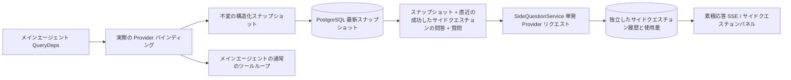

# ARTEX `/btw` サイドクエスチョン

日本語 · [中文](README.zh.md)

通常のチャット、タスクの MainAgent、そして現在のタスクが直接起動した Worker は、本文の会話から分離されたサイドクエスチョンをそれぞれサポートします。メイン入力欄に `/btw 質問` と入力するとサイドクエスチョンを送信でき、内容なしで `/btw` だけを入力するか「サイドクエスチョン」ボタンを押すと、過去のサイドクエスチョンの履歴が開きます。デスクトップでは幅を調整できるサイドバーとして、モバイルではドロワー(Drawer)として表示します。

サイドクエスチョンの応答は、質問を送信した時点のエージェントコンテキストのスナップショットをもとに生成され、ストリーミング表示・追加質問・停止・クリアをサポートします。パネルを閉じたり、ページを再読み込みしたり、SSE 接続が切れたりしても、モデルへのリクエストはキャンセルされません。停止は現在進行中のサイドクエスチョン 1 件だけに作用し、クリアはサイドクエスチョンをキャンセルしたうえでその履歴まで削除しますが、本文コンテキストのスナップショットはそのまま残します。

> この文書は、原本の中国語文書(`README.zh.md`)を日本語に翻訳したものです。アップストリーム(upstream)リポジトリの変更と照合しやすいように、原本はそのまま保存しています。

## 実装範囲

Go、norma v0.3.7、Next.js、および既存の Markdown · ResizablePanel · Drawer · AlertDialog コンポーネントをそのまま使用しており、norma のソースを変更したり、サイドクエスチョンのために新しい依存関係を追加したりはしていません。Planner、他のタスクから引き継いだ Worker、ツール型サブタスクの昇格は、今回の範囲に含まれません。

- `capture.go` は、`Options.Deps.CallModel` · `CallModelSync` からのリクエストだけをメインループのリクエストとして扱います。Provider デコレーターは個々のモデルの内部、つまりルーティングプールが外側でモデルを選んだあとの段階に位置するため、実際に選ばれたモデルを記録します。圧縮リクエストと要約リクエストは、スナップショットを上書きしません。
- スナップショットは、リクエストを開始した時点、モデルが応答を完結させた時点、実行が終了状態に達した時点に発行します。生成の途中にある半端な応答は発行しません。ツール呼び出しは norma の `MessagesForAPI` を通してペアを維持し、ツール結果は次のメインモデルリクエストまたは実行の終了状態でスナップショットに入ります。ストリーミングが中断された場合は、直前の有効な境界を維持します。
- スナップショットは JSON のディープコピーで、構造化メッセージ、システムプロンプト、ツール定義、生成パラメーターを保持します。モデル推論は、スナップショットのロックやデータベーストランザクションを保持しません。
- `SideQuestionService` は個々の Provider を呼び出します。必要に応じて先にサイドクエスチョンの要約を作成し、最終応答は、コンテキストが初めて上限を超え、かつまだテキストやツール呼び出しを出力していない場合に限り、縮小して 1 回だけ再試行します。エージェントセッションを新規に作成せず、ツール実行器・メイン transcript・アクティビティストリーム・タスクグラフには接続せず、タスクのモデル切り替えチェーンも経由しません。応答がツール定義を保持するのは既存の構造化ツールコンテキストとの互換性のためで、要約リクエストにはツールを提供しません。新たに返されたツール呼び出しには実行経路がありません。
- 親セッションごとに実行中のリクエストは 1 件、サービスプロセス 1 つにつき最大 4 件で、1 件のリクエストのタイムアウトは 120 秒です。サイドクエスチョンは、サービスのライフサイクルのもとで独立したキャンセルコンテキストを使用します。
- サイドクエスチョンのリクエストは、モデル設定への参照と、機密でない識別情報の要約を保持し、リクエスト時に既存の設定から認証情報を取得します。設定が削除されたり、モデル・プロトコル・アドレスといった識別フィールドが変更されたりした場合は、まずメインエージェントを実行してスナップショットを更新するよう求めます。テストは、製品のデフォルトモデルを変更しません。

## 永続化と復旧

`db/schema.sql` は `side_question_sessions` と `side_question_requests` テーブルを自動的に作成します。前者は親リソース、最新スナップショット、実行番号、バージョン、クリアバージョンを保存し、後者は質問、累積応答、状態、モデル、スナップショット時刻、使用量、イベント連番、ページ連番を保存します。

親セッションキーには conversation ID を使うか、task ID と exploration ID と intent ID を組み合わせて使います。Worker は、再利用可能な実行スロット名を使いません。

スナップショットは親セッション単位でマージして記録し、250 ミリ秒ごとに 1 回反映します。データベースが `(run_id, version)` を比較し、古いバージョンが最新バージョンを上書きできないようにします。サイドクエスチョンを送信する直前に、選択したスナップショットをもう一度保存します。保存に成功するとメモリ上の大きなスナップショットを解放し、失敗すると、まだ記録できていないバージョンを残しておきます。累積応答の内容は、ストリーミングイベントの到着時に最大 250 ミリ秒に 1 回の頻度で記録し、終了状態では即座に保存しますが、データベースエラーが発生した場合は限られた回数だけ再試行します。

サービスの起動時に、以前 `running` 状態のまま残っていたリクエストを `interrupted` としてマークします。すでにデータベースに保存されている一部の応答と使用量はそのまま残し、リクエストを自動的に再実行することはありません。最後に正常に保存したコンテキストは、次の質問にすぐ使えます。古いセッションにスナップショットがない場合は、まずメインエージェントを実行するよう求め、UI のアクティビティ履歴からコンテキストを再構築することはしません。

クリア操作はクリアバージョンを 1 つ上げてリクエストを削除し、条件付き更新によって、遅れて到着したコールバックが再度記録されるのを防ぎます。親リソースを物理削除する場合は外部キーのカスケードに任せ、Worker を論理削除する場合は同じトランザクション内でサイドクエスチョンのデータも一緒に削除し、その後に遅れて到着するスナップショットを拒否します。タスクをアーカイブするときは、まず新しいリクエストを止め、メインのフローが停止するのを待ち、サイドクエスチョンをキャンセルしたうえで、データベースに反映されるのを待ちます。アーカイブ形式は v3 で、サイドクエスチョンのテーブルがない v1 · v2 とも互換性があります。

履歴は漏れなく保存し、連番カーソルを基準に 1 ページあたり最大 20 件を返します。モデルへのリクエストには、直近に成功した問答の原文を最大 20 組まで再度載せますが、その分量はトークン予算に合わせて制限し、それより古い問答は別途ローリング要約として管理します。本文コンテキストが予算を超えた場合は、サイドクエスチョン用のコピーの古い部分だけを要約し、直近の構造化ツール呼び出しとその結果は残します。要約、準備の進行状況、使用量は、いずれもサイドクエスチョンの同時実行・キャンセル・120 秒タイムアウトのルールの中にまとめて含まれます。詳細は [コンテキスト予算とオープンソース参考資料(CONTEXT_BUDGET.md)](CONTEXT_BUDGET.md) を参照してください。

## HTTP コントラクト

次のパスを `{parent}` として使用し、既存の認証とリソース検証にそのまま従います。

- `/api/conversations/{id}`
- `/api/tasks/{id}/chat`
- `/api/tasks/{id}/intents/{iid}`

リクエストごとの返却内容と動作は次のとおりです。

- `GET {parent}/side-questions?before={ordinal}` は `items` を新しい順に並べて返し、進行中の実行状態(`current`)、スナップショットのメタ情報(`snapshot`)、次のカーソル(`next_cursor`)も合わせて返します。カーソルが 0 の場合は、最新のページであるか、次のページがないことを意味します。
- `POST {parent}/side-questions` は `{ "question": "…", "client_request_id": "UUID" }` 形式の JSON を受け取ります。新規リクエストであれば 202 とともにリクエストオブジェクトを返し、ID と質問が同じであれば既存のオブジェクトを 200 で返します。
- `DELETE {parent}/side-questions` は、現在の親セッションのサイドクエスチョンの問答をキャンセルしてクリアします。
- `GET /api/side-questions/{requestID}/events` は `snapshot` SSE イベントを送信します。`id` は増加する連番で、`data` は累積された完全なリクエストオブジェクトです。クリアが発生した場合は `cleared` を送信します。
- `POST /api/side-questions/{requestID}/cancel` はリクエストを明示的にキャンセルし、終了状態は履歴や SSE から読み取れます。

質問は最大 4000 文字です。スナップショットがない場合、モデル設定が変更された場合、同じ親セッションが処理中の場合、または冪等 ID が衝突した場合は 409 を返し、全体の同時実行上限に達した場合は 429 を返します。SSE 接続は毎回、先に累積状態を送信するため、クライアントが先に受け取ったテキスト断片に依存することはありません。フロントエンドはリクエスト ID と連番で応答を結合し、親セッションの切り替えやクリアの際には、以前のコールバックを破棄します。

## 検証と参考資料

自動チェック、実際のモデルの使用、既知の制限は [VALIDATION.md](VALIDATION.md) にまとめています。

独立リクエスト方式は [Grok CLI の side-question.ts(固定コミット)](https://github.com/superagent-ai/grok-cli/blob/fb97af83f06dca873281d60168430f06c8de6324/src/utils/side-question.ts) を、実行の分離は [OpenCode(固定コミット)](https://github.com/anomalyco/opencode/tree/b3f1a96c6dd7adeb28b36dd11add1998fc84d67b) を参考にしました。ARTEX はコンテキストに norma の構造化メッセージを使用しており、フロントエンドのログからテキストを連結する方式は使っていません。
